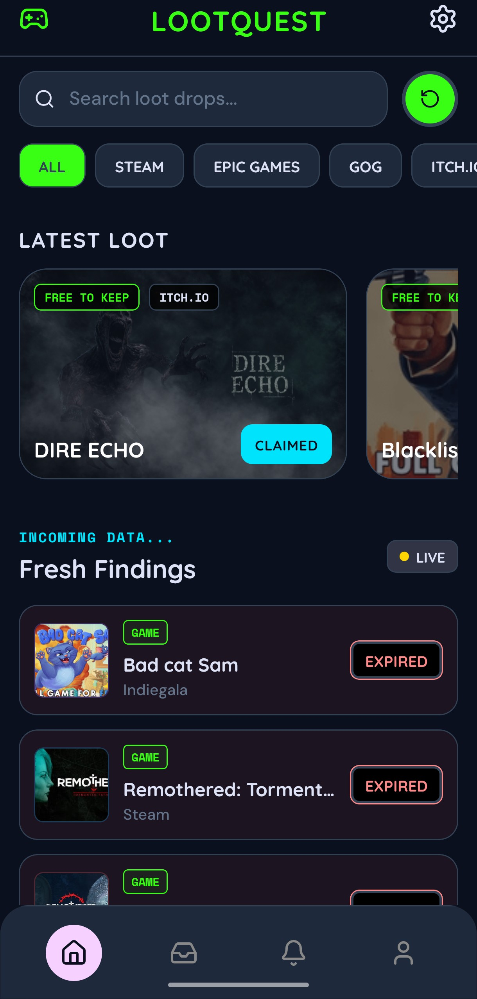
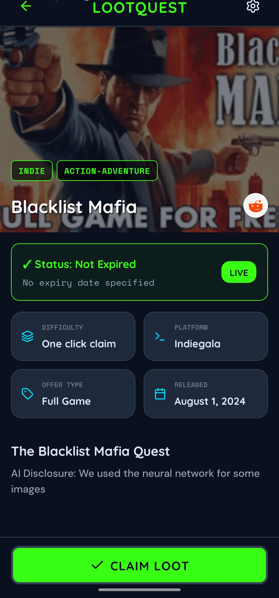
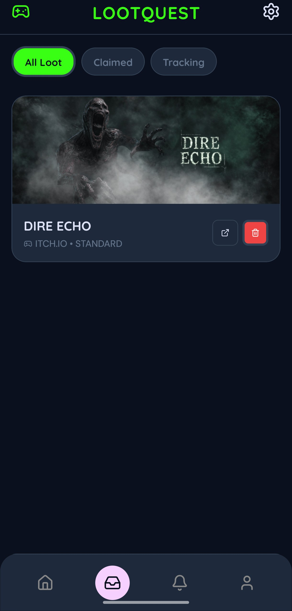
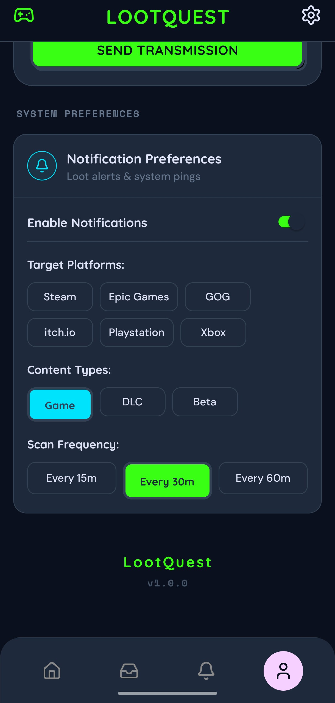

<div align="center">

# 🎮 LootQuest

[](https://reactnative.dev)
[](https://expo.dev)
[](https://www.typescriptlang.org)
[](LICENSE)
[](https://discord.gg/pXxnhKWdGH)

**Track free game giveaways from multiple platforms in one place. Never miss a free game again.**

[📥 Download Latest APK (Beta)](https://github.com/EklavyaAhuja/LootQuest/releases/download/v1.0.0/LootQuest-v1.0.0-beta.apk)

</div>

---

## 📖 Overview

**LootQuest** is a modern, dark-themed mobile application designed to help gamers discover, track, and claim free game giveaways across multiple storefronts (Steam, Epic Games, GOG, itch.io, PlayStation, Xbox, and mobile). 

Instead of manual daily checking across forums and sites, LootQuest aggregates giveaways into a unified feed, enriches them with storefront metadata, runs background checks to notify you of new deals instantly, and lets you track your claimed rewards in a personal vault.

---

## ✨ Key Features

### 📱 Unified Giveaway Feed
- Live listings consolidated from **Reddit (r/FreeGameFindings)** and **GamerPower API**.
- Platform-specific color coding and visual store badges for instant recognition.
- Smart sorting that prioritizes fresh active giveaways.

### 🔍 Rich Storefront Metadata (Enrichment Engine)
- **Steam Details**: Pulls developer/publisher credits, user ratings, SteamDB scores, achievements, genres, and release dates directly from the Steam Store API.
- **Epic Games Details**: Scrapes Epic Games Store API for promotional end dates, original values, and high-res promotional imagery.
- **Auto-Redirect Resolution**: Resolves obfuscated tracking/redirect URLs (like GamerPower open links) programmatically in the background to access direct storefront APIs.

### ⏱️ Expiry & Countdown Tracking
- Real-time client-side countdown timers displaying exact hours/days remaining.
- Visual alerts for giveaways expiring soon.
- Automatic filtering and demarcation of expired promotions.

### 🔔 Smart Background Sync & Notifications
- Periodic background worker (configurable intervals: 15, 30, or 60 minutes) fetching new giveaways.
- Delivery of local notifications using a custom system channel and custom sound alert.
- Dynamically throttled checking to respect system resources and preserve battery.

### 🔞 NSFW Safety Gate
- Blur filters applied to NSFW game thumbnails to ensure safe browsing.
- Interactive, explicit age verification gate before viewing adult-only titles.

### 🛡️ Claim Vault
- Persistent local inventory system to save claimed games.
- Visual indicator to show which giveaways you have already completed.
- Watch-list support for upcoming or ongoing offers.

---

## 📸 Screenshots

> [!TIP]
> *Upload your updated screenshots to the `/screenshots` folder and replace the file paths below to refresh the visual showcase.*

| Home Feed | Giveaway Details |
| :---: | :---: |
|  |  |

| Personal Vault | Settings & Notifications |
| :---: | :---: |
|  |  |

---

## 🛠️ Architecture & Tech Stack

### Mobile Client (Frontend)
- **Core Framework**: React Native (via **Expo SDK 54**)
- **Language**: TypeScript
- **State & Local Storage**: 
  - `AsyncStorage` for feed caching and claims tracking.
  - `SecureStore` for encrypted user settings and tokens.
- **Styling**: Curated dark theme built on HSL palettes with micro-animations via custom pressable behaviors (`BouncyPressable`).
- **Background Tasks**: `Expo TaskManager` & `BackgroundFetch`
- **Notifications**: `Expo Notifications`

### Backend Aggregator (Scraper & Proxy)
- **Platform**: Node.js & Express
- **Reddit RSS Pipeline**:
  - Implements multi-tier request fallbacks (Direct RSS -> OpenRSS -> RSSHub) to bypass Cloudflare rate-limits (`429`) and connection resets.
  - Custom XML/Atom parser with CDATA normalization and regex-based HTML decoding.
- **Admin Dashboard Log Viewer**: Real-time console logger interception with a secure `/admin/logs` viewer endpoint for checking aggregator performance.

---

## 🚀 Development Setup

### Mobile Client

1. **Clone the repository:**
   ```bash
   git clone https://github.com/EklavyaAhuja/LootQuest.git
   cd LootQuest
   ```

2. **Install dependencies:**
   ```bash
   npm install
   ```

3. **Configure environment variables:**
   Copy the example environment file:
   ```bash
   cp .env.example .env
   ```
   *Edit `.env` and configure `EXPO_PUBLIC_DISCORD_WEBHOOK_URL` if you want to test anonymous feedback submission.*

4. **Start the Expo server:**
   ```bash
   npx expo start
   ```
   *Press `a` to run on an Android Emulator, `i` for iOS Simulator, or scan the QR code to run on your physical device via the Expo Go app.*

---

### Backend Server (Optional)

If you wish to host your own RSS scraping aggregator proxy locally:

1. **Navigate to the backend directory:**
   ```bash
   cd fgf-backend
   ```

2. **Install dependencies:**
   ```bash
   npm install
   ```

3. **Start the Express server:**
   ```bash
   npm start
   ```
   The backend scraper will run on `http://localhost:5000` (or the port specified in your `.env`).

---

## 📦 Installation (Production APK)

1. Navigate to the [Releases](https://github.com/EklavyaAhuja/LootQuest/releases) section of this repository.
2. Download the latest `.apk` asset file.
3. Enable **Install from Unknown Sources** in your Android device's security settings.
4. Open the downloaded `.apk` file to install the application.
5. Launch LootQuest and start collecting freebies!

---

## 💬 Community & Feedback

If you find a bug, have a suggestion, or want to contribute:
- **Discord Invite**: Join our community chat on [Discord](https://discord.gg/pXxnhKWdGH).
- **In-App Feedback**: Submit bug reports and feature requests directly inside the app's settings drawer (delivered anonymously to our Discord channel).
- **GitHub Issues**: Open a new issue in this repository with your device model and steps to reproduce.

---

## ⚖️ Disclaimer

*LootQuest is an aggregator and client-side manager. LootQuest does not host, distribute, or license any games. All trademarks, logos, screenshots, and game copyrights belong to their respective developers, publishers, and storefront platforms.*

---

## 📄 License

This project is licensed under the **MIT License** - see the [LICENSE](LICENSE) file for details.
