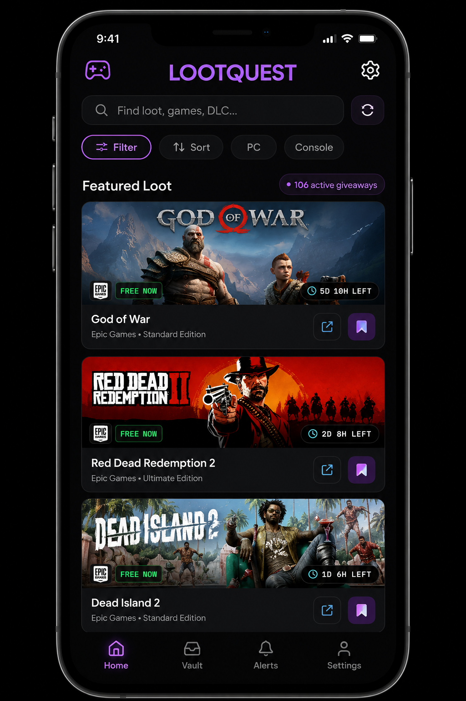
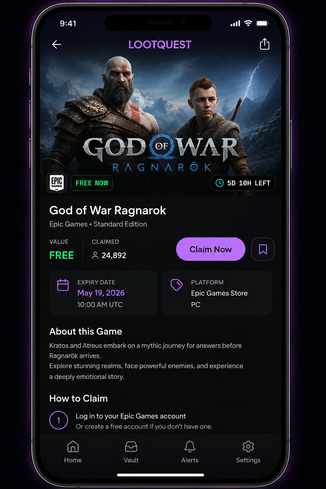
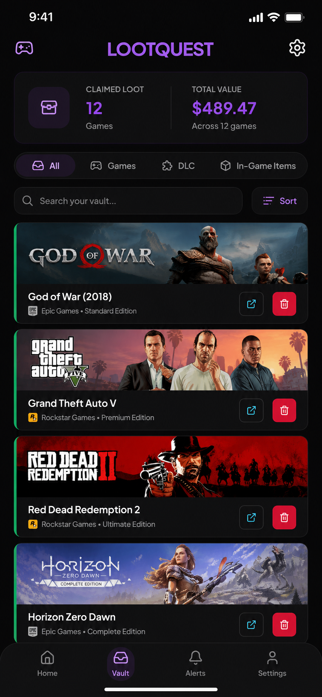
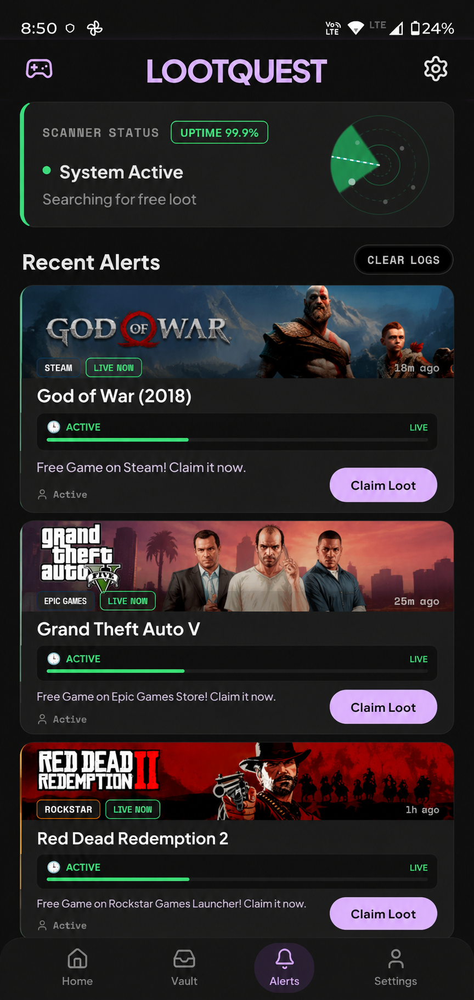
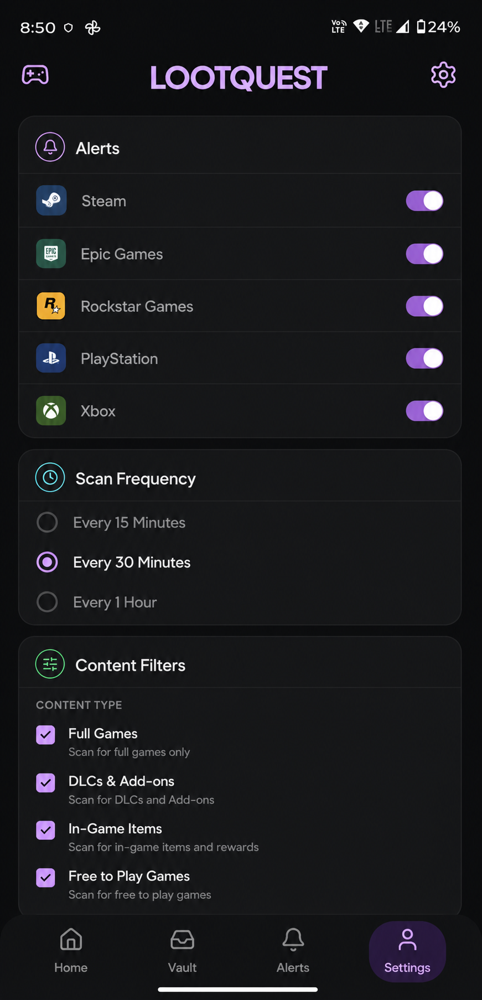

# 🎮 LootQuest

<div align="center">


### Never Miss a Free Game Again

Track giveaways from Steam, Epic Games, GOG, itch.io, PlayStation, Xbox and more in one place.

[📥 Download Beta APK](https://github.com/EklavyaAhuja/LootQuest/releases/download/v1.1.0/LootQuest-v1.1.0-beta.apk)

---

Track • Claim • Get Notified • Build Your Vault

</div>

---

# 🚀 Why LootQuest?

Every day, dozens of free games, DLCs, beta keys and in-game rewards are released across multiple platforms.

Most gamers discover them too late.

LootQuest solves this by aggregating giveaways from multiple sources into a single mobile experience with smart notifications, claim tracking, and platform filtering.

---

# 📸 App Preview

<div align="center">

|                       Home Feed                      |                   Giveaway Details                   |                         Vault                         |
| :--------------------------------------------------: | :--------------------------------------------------: | :---------------------------------------------------: |
|  |  |  |

|                         Alerts                         |                         Settings                         |
| :----------------------------------------------------: | :------------------------------------------------------: |
|  |  |

</div>

---

# ✨ Features

## 🎯 Unified Giveaway Feed

* Steam giveaways
* Epic Games promotions
* GOG freebies
* itch.io rewards
* PlayStation offers
* Xbox promotions
* Community-discovered giveaways

Everything in one place.

---

## 🔍 Rich Giveaway Details

Every listing includes:

* Publisher & developer information
* Platform metadata
* Store ratings
* Giveaway value
* Expiry dates
* Claim instructions

No more opening five tabs to understand a giveaway.

---

## ⏳ Real-Time Expiry Tracking

* Live countdown timers
* Expiring-soon indicators
* Active/inactive status
* Automatic expiry detection

Never lose a giveaway because you forgot about it.

---

## 🔔 Smart Notifications

Get notified when:

* New giveaways appear
* Major promotions go live


Choose exactly which platforms you care about.

---

## 🏆 Claim Vault

Build your own giveaway collection.

* Track claimed games
* Store reward history
* Monitor total collection value
* Prevent duplicate claims

---

## ⚖️ Safe Browsing

* NSFW thumbnail blur
* Age verification gate
* Content filtering controls

---

# 🏗️ Tech Stack

### Mobile App

* React Native
* Expo SDK 54
* TypeScript
* AsyncStorage
* SecureStore
* Expo Notifications
* Expo Background Fetch

### Backend

* Node.js
* Express
* RSS Aggregation Engine
* Giveaway Enrichment Pipeline
* Multi-layer Fallback System

---

# 🚀 Getting Started

## Clone

```bash
git clone https://github.com/EklavyaAhuja/LootQuest.git
cd LootQuest
```

## Install

```bash
npm install
```

## Run

```bash
npx expo start
```

---

# 📦 Download

Download the latest Android beta:

[LootQuest v1.1.0 Beta APK](https://github.com/EklavyaAhuja/LootQuest/releases/download/v1.1.0/LootQuest-v1.1.0-beta.apk)

---

# 💬 Community

Discord:
https://discord.gg/pXxnhKWdGH

Issues:
Open a GitHub Issue

Feedback:
Use the built-in feedback system inside the app.

---

# ⚖️ Disclaimer

LootQuest does not host, distribute, or license games.

All game assets, trademarks, logos and intellectual property belong to their respective owners.

---

# 📄 License

MIT License
